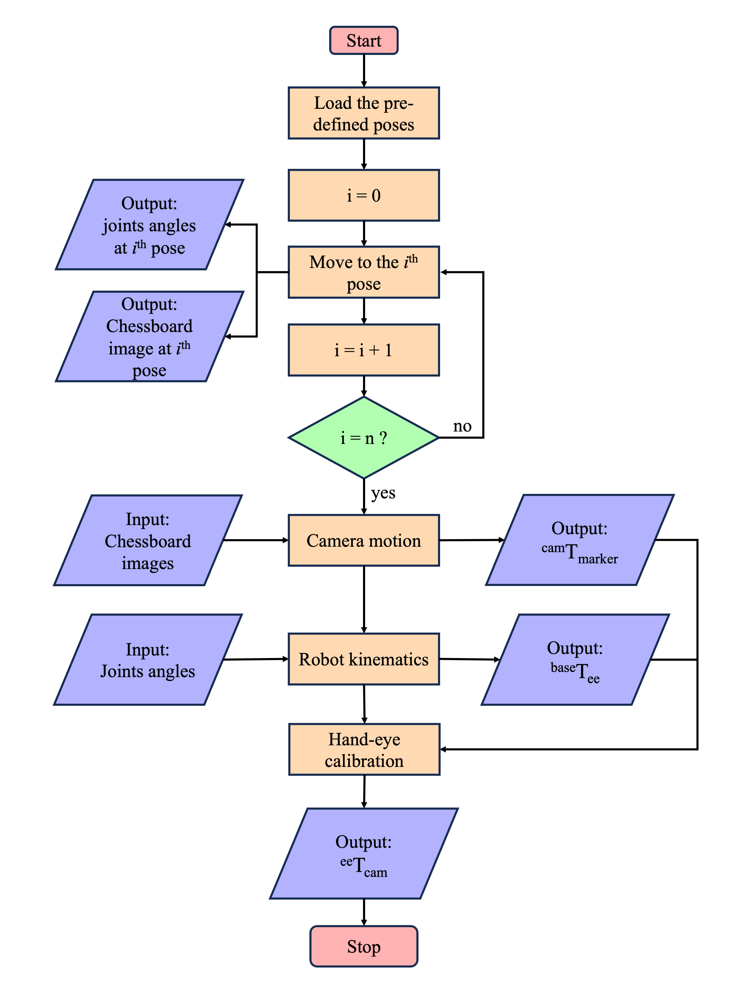
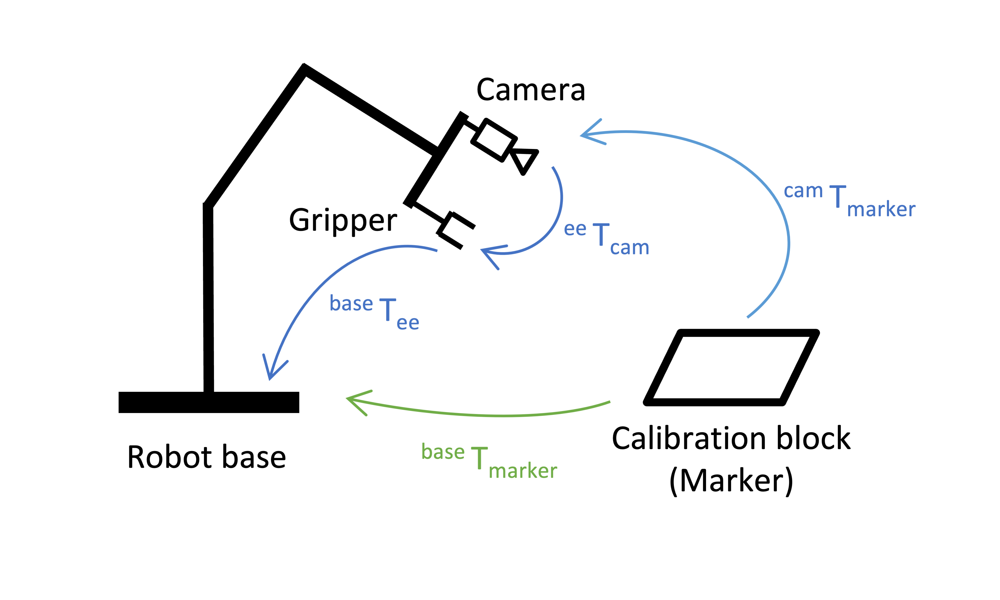

## Visual_Tracking
Authors: Zijie cHEn (zijie-chen.20@ucl.ac.uk)

## Reconstruction Demo
(click the picture to watch the video)

## Marker Tracking Demo
(click the picture to watch the video)

## Hand-eye Calibration Flowchart

## Elephant Robot
https://github.com/elephantrobotics/mycobot_ros

## Robot Calibration
https://github.com/kefhuang/mycobot_ros

## OpenCV
https://docs.opencv.org/4.8.0/

## Pymycobot
https://github.com/elephantrobotics/pymycobot

